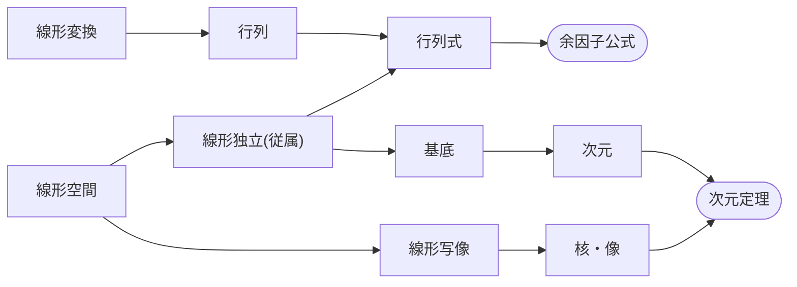

## 内容

### 概念

* 線形空間(linear space), ベクトル空間(vector space), ベクトル(vector)
* 線形写像(linear map)，行列(matrix)
* 基底(base), 次元(dimension)
* 線形独立(linearly independent), 線形従属(linearly dependent)
* 行列式(determinant)
* 固有値(eigenvalue), 固有ベクトル(eigen vector)
* 対称行列(symmetric matrix), 正定値(positive definite)
* 基底変換(change of basis), 対角化(diagonalize)
* 内積(inner product)
* 最小多項式(minimal polynomial)

### 定理・アルゴリズム

* 行列式の余因子公式(cofactor formula)
* 次元定理(dimension theorem)
* Gauss の消去法(Gaussian Elimination)
* Gram-Schmidt の直交化法(Orthogonalization by Gram-Schmidt)
* 最小二乗法(least squares solutions)
* 射影定理(projection theorem)

### 解かれる問題

* 線形方程式系を解く問題
* 平行 n 面体の体積を求める問題
* 線形回帰を求める問題
* 行列の冪乗を計算する問題

## 資料

* 🎓 [MIT OCW/Gilbert Strang/Linear Algebra](https://ocw.mit.edu/courses/18-06-linear-algebra-spring-2010/pages/syllabus/)
* 📘 [嶺幸太郎『線形代数学』](http://www.math.kanagawa-u.ac.jp/mine/linear_alg/index.html)
* 🌐 [elevri/Linear Algebra](https://www.elevri.com/courses/linear-algebra)
* 🎥 [3Blue1BrownJapan/線形代数のエッセンス](https://www.youtube.com/watch?v=ZXuZHNjS2tA&list=PL5WufEA7WHQGX7Su06JzbPDXUQGOd0wlq)
